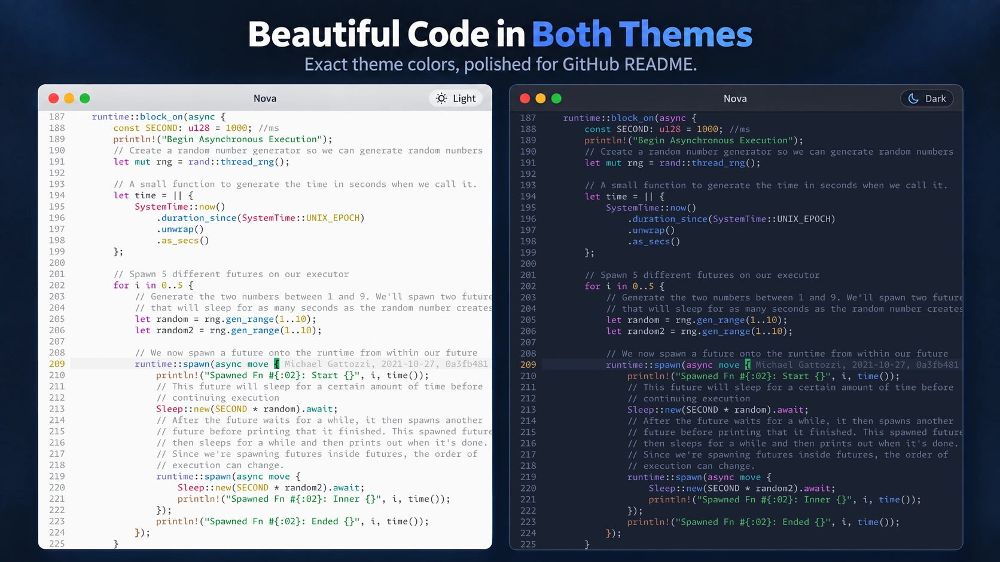
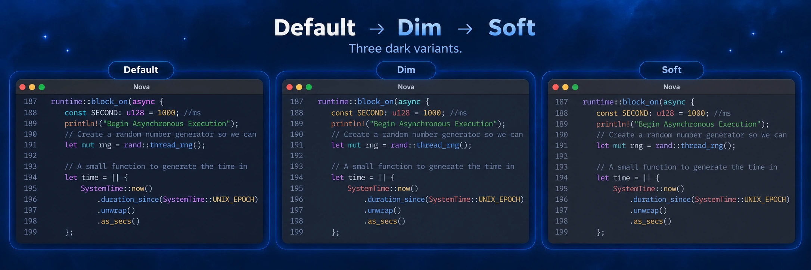
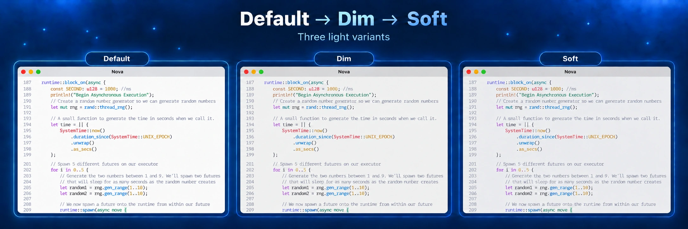

# Nova

Nova is a focused true-color colorscheme for Neovim, written in Lua. It pairs a cool, restrained interface with semantic syntax colors, independently tuned dark and light palettes, and three levels of visual intensity.



## Highlights

- Dark and light themes, each available in `default`, `dim`, and `soft` variants.
- Coverage for the built-in UI, classic syntax groups, modern Tree-sitter captures, LSP semantic tokens, and diagnostics.
- A small semantic palette with separate roles for surfaces, syntax, search matches, navigation targets, and diffs.
- Optional transparent editor background.
- Palette and highlight overrides as either tables or functions.
- Focused integrations for commonly used Neovim plugins, plus a matching lualine theme.
- No runtime dependencies and no need to install supported plugins before loading Nova.

## Variants

Variants change the palette without changing highlight semantics. Dark and light palettes are tuned independently instead of applying one symmetric transformation to both modes.

| Variant | Character |
| --- | --- |
| `default` | Highest chroma and strongest visual separation. |
| `dim` | A quieter middle palette with reduced chroma. |
| `soft` | Lowest visual intensity; dark mode also compresses contrast, while light mode keeps text contrast strong. |

### Dark



### Light



## Requirements

- Neovim 0.12.5.
- A UI or terminal with true-color support.
- Git when installing through Neovim's native package manager.

Nova enables `termguicolors` when the colorscheme loads.

## Installation

Nova is currently developed on the `dev` branch. The examples below follow that branch so the documented palettes and configuration API are available. `master` remains the stable branch.

### Neovim packages

Neovim 0.12 includes a native package manager:

```lua
vim.pack.add({
    {
        src = "https://github.com/zanglg/nova.nvim",
        version = "dev",
    },
})

require("nova").setup()
vim.cmd.colorscheme("nova")
```

### lazy.nvim

```lua
{
    "zanglg/nova.nvim",
    branch = "dev",
    lazy = false,
    priority = 1000,
    config = function()
        require("nova").setup()
        vim.cmd.colorscheme("nova")
    end,
}
```

`setup()` is optional when the defaults are sufficient; `vim.cmd.colorscheme("nova")` can be used on its own.

## Configuration

```lua
require("nova").setup({
    theme = "auto",
    variant = "default",
    transparent = false,
    colors = {},
    overrides = {},
})

vim.cmd.colorscheme("nova")
```

| Option | Type | Default | Description |
| --- | --- | --- | --- |
| `theme` | `"auto" \| "dark" \| "light"` | `"auto"` | Selects the appearance mode. |
| `variant` | `"default" \| "dim" \| "soft"` | `"default"` | Selects the palette intensity. |
| `transparent` | `boolean` | `false` | Removes the main editor background while keeping floats and menus styled. |
| `colors` | `table \| function` | `{}` | Overrides semantic palette values. |
| `overrides` | `table \| function` | `{}` | Replaces highlight definitions after all built-in groups are assembled. |

Nova validates all top-level options. Unknown keys, unsupported values, and invalid option types raise an error instead of being silently ignored.

Calling `setup()` updates Nova's configuration; reload the colorscheme to apply the new settings:

```lua
require("nova").setup({ variant = "soft" })
vim.cmd.colorscheme("nova")
```

### Theme selection

With `theme = "auto"`, Nova reads the current value of `vim.o.background` every time the colorscheme loads:

```lua
vim.o.background = "light"
vim.cmd.colorscheme("nova")
```

An explicit `"dark"` or `"light"` theme also synchronizes `vim.o.background` when Nova loads, keeping Neovim and plugin defaults on the same appearance mode.

### Palette overrides

`colors` may be a table containing only the values you want to replace:

```lua
require("nova").setup({
    colors = {
        blue = "#80aaff",
        popupmenu = "#20263a",
        target = "#67e8f9",
    },
})
```

It may also be a function. The function receives a copy of the selected variant's base palette and the resolved `"dark"` or `"light"` theme, then returns an override table:

```lua
require("nova").setup({
    theme = "auto",
    colors = function(colors, theme)
        return {
            blue = theme == "light" and "#356ac3" or "#80aaff",
            target = colors.teal,
        }
    end,
})
```

Available palette roles are:

- Surfaces and text: `foreground`, `comment`, `inconspicuous`, `splitline`, `selection`, `popupmenu`, `stripline`, `background`.
- Syntax accents: `red`, `orange`, `yellow`, `green`, `teal`, `blue`, `violet`, `purple`.
- Search and navigation: `match`, `current_match`, `target`.
- Diff surfaces: `diff_add_bg`, `diff_change_bg`, `diff_delete_bg`, `diff_text_bg`.

Diff surfaces are derived after palette overrides are applied. Changing `green`, `blue`, `red`, or `background` therefore recomputes the related diff colors; explicitly overriding a `diff_*` value preserves that value.

### Highlight overrides

`overrides` are applied last and may replace any built-in, Tree-sitter, LSP, or plugin highlight group:

```lua
require("nova").setup({
    overrides = {
        CursorLineNr = { fg = "#ffffff", bold = true },
        ["@comment.todo"] = { fg = "#ffcc66", bold = true },
    },
})
```

A function receives Nova's final resolved palette, including color overrides and generated diff colors:

```lua
require("nova").setup({
    overrides = function(colors)
        return {
            CursorLineNr = { fg = colors.target, bold = true },
            Visual = { bg = colors.popupmenu },
        }
    end,
})
```

Each supplied highlight definition replaces the corresponding Nova definition; highlight fields are not merged individually.

## Lualine

Nova ships a lualine theme that follows the resolved Nova theme, variant, and palette overrides. Configure Nova before lualine loads its theme:

```lua
require("nova").setup({
    theme = "auto",
    variant = "dim",
})
vim.cmd.colorscheme("nova")

require("lualine").setup({
    options = {
        theme = "nova",
    },
})
```

## Plugin integrations

Nova prefers plugin defaults when they already link to standard Neovim groups. Dedicated overrides are limited to places where Nova has a meaningful semantic or presentation choice.

Current integrations include:

- `blink.cmp`
- `flash.nvim`
- `gitsigns.nvim`
- `indent-blankline.nvim`
- `lazy.nvim`
- `LuaSnip`
- `mason.nvim`
- `noice.nvim`
- `nvim-cmp`
- `nvim-dap` and `nvim-dap-ui`
- `nvim-tree.lua`
- `outline.nvim`
- `rainbow-delimiters.nvim`
- `snacks.nvim`
- `telescope.nvim`
- `trouble.nvim`

These integrations only define highlight groups. They neither load plugins nor require the plugins to be installed.

## UI and terminal behavior

Nova keeps floating-window primitives separate so each plugin can choose the presentation appropriate for its UI:

- `NormalFloat` defines the popup surface.
- `FloatBorder` defines structural separation.
- `PmenuSel` defines the selected completion-menu item.

Nova targets true-color Neovim interfaces and intentionally does not define `terminal_color_0` through `terminal_color_15`. ANSI colors inside terminal buffers remain the responsibility of the terminal emulator or user configuration.

## Development

Active development happens on `dev`; `master` is the stable/release branch. See [CONTRIBUTING.md](CONTRIBUTING.md) for the branch workflow, palette and integration policies, and review expectations.

Check formatting:

```sh
stylua --check .
```

Run the headless test suite:

```sh
nvim --headless -u NONE --cmd "set rtp+=$PWD" -l tests/run.lua
```

The suite covers configuration validation, all six palettes, highlight construction, repeated colorscheme loading, lualine integration, and stale-reference checks. Palette and presentation changes should also be reviewed in a real Neovim UI.

## License

[MIT](LICENSE) © 2022 Zang Leigang
